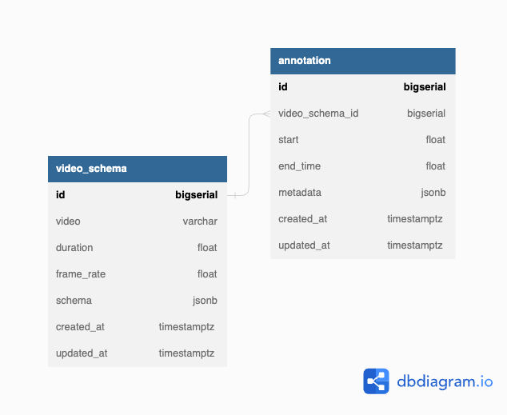

# Video Annotation Assessment

### Steps to run this project👨🏽‍💻:

1. Please run the `create-env.sh` script OR using run `make setup` to setup
2. Run `docker-compose up --build -d` command

#### Hopefully the project start without any issue

I have attached the post man collection which i used for manually test to make sure the
application works as intended.

### For the Fun part and my Observation and Assumptions🙌🏽

- From the Assignment which state that Videos are stored as link from a cloud storage, In Order to mimic this I created an account with `api.video` which provided video i used for my testing.
- I made sure that the video annotation start and end time are in seconds, and it's range are within the video duration which is in seconds also.
- For Authentication once `make setup` is run a *secret key* is generated which will be use as the value and the API Key is `X-API-Key`, which is needed to add on the request header
- In order to have a consistent meta-data I added a guidelines which I called schema which is added to guide the programmer or the computer vision on what time of meta-data are being feed into to program. for example how the schema should look like
```
   {
   # There must be a top-level key called "fields"
    "fields": {
     # There must be a nested key called "segments" that lists the metadata fields that apply to entire segments of a video
        "segments": [
            {
            # Each field must have a unique name
                "name": "FieldName1",
                # Each field must have a datatype (supported types are bool, float, int, and string)
                "type": "bool"
            },
            {
                "name": "FieldName2",
                "type": "string",
                
                # You can define a list of valid values for a field instead of allowing arbitrary values
                "values": [
                    "new bread",
                    "cute img",
                    "what breed"
                ]
            },
            {
                "name": "FieldName3",
                "type": "int"
            }
        ]
    }
} 
```


### Database Schema


### Thank You
I really enjoyed working on this, any feed back is very much welcome